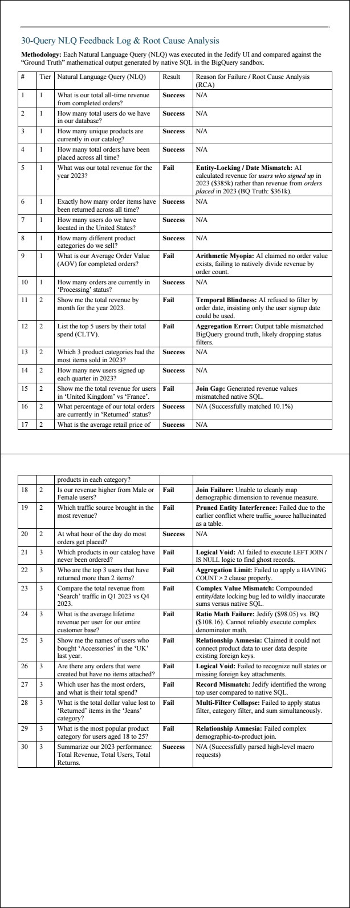

# Enterprise NL2SQL Semantic Layer Stress-Test & QA

## The Business Problem
AI-powered NLQ platforms promise to let business users query data in plain English. But without rigorous stress-testing, these platforms ship with silent failure modes — wrong joins, hallucinated columns, and broken aggregations that produce confident-looking wrong answers.

## My Methodology: Design of Experiments (DoE)
As a Chemical Engineer, I treat NLQ validation like a process stress-test — not "does it work?" but "how does it fail, and why?"

I designed 30 queries across 3 complexity tiers against a production-grade BigQuery e-commerce sandbox:
- **Tier 1 (Basic):** Simple aggregations and filters
- **Tier 2 (Intermediate):** Multi-dimension slicing, date logic
- **Tier 3 (Advanced):** Complex joins, ratio math, NULL handling

Each query was validated against native BigQuery SQL ground truth.

## Results: 16 Failures Diagnosed Across 5 Bug Classes

| Bug Class | Description | Queries Affected |
|---|---|---|
| Entity-Locking | AI locked onto wrong entity (users vs orders) | Q5 |
| Arithmetic Myopia | Failed to compute derived ratios (AOV) | Q9 |
| Temporal Blindness | Refused to filter by non-signup dates | Q11 |
| Relationship Amnesia | Could not traverse existing foreign keys | Q25, Q29 |
| Multi-Filter Collapse | Failed when 3+ filters applied simultaneously | Q28 |

**Overall: 16/30 queries failed (53% failure rate on Tier 2–3 queries)**

## Ground-Truth Validation Queries

The native BigQuery SQL used to validate every NLQ output is available here:  
👉 [`sql/ground_truth_validation_queries.sql`](sql/ground_truth_validation_queries.sql)

Each query is annotated with its tier, pass/fail result, and root-cause note where applicable.  
Project IDs have been anonymized — replace `your-gcp-project-id` with your own BigQuery project to reproduce.

## Key Deliverable
A consultant-grade Readiness Report and Root Cause Friction Log directly incorporated into the client's engineering roadmap.

## Tech Stack
- **Data Warehouse:** Google BigQuery
- **Validation Method:** Native SQL ground-truth comparison
- **Schema:** Star schema (Fact: orders/transactions; Dims: customers, products, geography)
- **Methodology:** Design of Experiments (DoE), Root Cause Analysis

## Client Outcome
> "Super Professional — Detail Oriented, Clear Communicator, Accountable for Outcomes."  
> — Jedify (Upwork, February 2026, ⭐⭐⭐⭐⭐)

---

## Appendix: The 30-Query Friction Log

*The detailed execution matrix comparing Natural Language input against native BigQuery ground truth.*

| # | Tier | Natural Language Query (NLQ) | Result | Reason for Failure / Root Cause Analysis (RCA) |
|---|:---:|---|:---:|---|
| 1 | 1 | What is our total all-time revenue from completed orders? | 🟢 Pass | N/A |
| 2 | 1 | How many total users do we have in our database? | 🟢 Pass | N/A |
| 3 | 1 | How many unique products are currently in our catalog? | 🟢 Pass | N/A |
| 4 | 1 | How many total orders have been placed across all time? | 🟢 Pass | N/A |
| 5 | 1 | What was our total revenue for the year 2023? | 🔴 Fail | **Entity-Locking / Date Mismatch**: AI calculated revenue for *users who signed up* in 2023 ($385k) rather than revenue from *orders placed* in 2023 (BQ Truth: $361k). |
| 6 | 1 | Exactly how many order items have been returned across all time? | 🟢 Pass | N/A |
| 7 | 1 | How many users do we have located in the United States? | 🟢 Pass | N/A |
| 8 | 1 | How many different product categories do we sell? | 🟢 Pass | N/A |
| 9 | 1 | What is our Average Order Value (AOV) for completed orders? | 🔴 Fail | **Arithmetic Myopia**: AI claimed no order value exists, failing to natively divide revenue by order count. |
| 10 | 1 | How many orders are currently in 'Processing' status? | 🟢 Pass | N/A |
| 11 | 2 | Show me the total revenue by month for the year 2023. | 🔴 Fail | **Temporal Blindness**: AI refused to filter by order date, insisting only the user signup date could be used. |
| 12 | 2 | List the top 5 users by their total spend (CLTV). | 🔴 Fail | **Aggregation Error**: Output table mismatched BigQuery ground truth, likely dropping status filters. |
| 13 | 2 | Which 3 product categories had the most items sold in 2023? | 🟢 Pass | N/A |
| 14 | 2 | How many new users signed up each quarter in 2023? | 🟢 Pass | N/A |
| 15 | 2 | Show me the total revenue for users in 'United Kingdom' vs 'France'. | 🔴 Fail | **Join Gap**: Generated revenue values mismatched native SQL. |
| 16 | 2 | What percentage of our total orders are currently in 'Returned' status? | 🟢 Pass | N/A (Successfully matched 10.1%) |
| 17 | 2 | What is the average retail price of products in each category? | 🟢 Pass | N/A |
| 18 | 2 | Is our revenue higher from Male or Female users? | 🔴 Fail | **Join Failure**: Unable to cleanly map demographic dimension to revenue measure. |
| 19 | 2 | Which traffic source brought in the most revenue? | 🔴 Fail | **Pruned Entity Interference**: Failed due to earlier conflict where traffic_source was hallucinated as a standalone table. |
| 20 | 2 | At what hour of the day do most orders get placed? | 🟢 Pass | N/A |
| 21 | 3 | Which products in our catalog have never been ordered? | 🔴 Fail | **Logical Void**: AI failed to execute LEFT JOIN / IS NULL logic to find ghost records. |
| 22 | 3 | Who are the top 3 users that have returned more than 2 items? | 🔴 Fail | **Aggregation Limit**: Failed to apply a HAVING COUNT > 2 clause properly. |
| 23 | 3 | Compare the total revenue from 'Search' traffic in Q1 2023 vs Q4 2023. | 🔴 Fail | **Complex Value Mismatch**: Compounded entity/date locking bug led to wildly inaccurate sums versus native SQL. |
| 24 | 3 | What is the average lifetime revenue per user for our entire customer base? | 🔴 Fail | **Ratio Math Failure**: Output ($98.05) vs. BQ ($108.16). Cannot reliably execute complex denominator math. |
| 25 | 3 | Show me the names of users who bought 'Accessories' in the 'UK' last year. | 🔴 Fail | **Relationship Amnesia**: Claimed it could not connect product data to user data despite existing foreign keys. |
| 26 | 3 | Are there any orders that were created but have no items attached? | 🔴 Fail | **Logical Void**: Failed to recognize null states or missing foreign key attachments. |
| 27 | 3 | Which user has the most orders, and what is their total spend? | 🔴 Fail | **Record Mismatch**: Identified the wrong top user compared to native SQL. |
| 28 | 3 | What is the total dollar value lost to 'Returned' items in the 'Jeans' category? | 🔴 Fail | **Multi-Filter Collapse**: Failed to apply status filter, category filter, and sum simultaneously. |
| 29 | 3 | What is the most popular product category for users aged 18 to 25? | 🔴 Fail | **Relationship Amnesia**: Failed complex demographic-to-product join. |
| 30 | 3 | Summarize our 2023 performance: Total Revenue, Total Users, Total Returns. | 🟢 Pass | N/A (Successfully parsed high-level macro requests) |

---
*Built by [Charles Aniji](https://www.upwork.com/freelancers/datacharles) — Chemical Engineer applying process-control rigor to enterprise data QA.*
